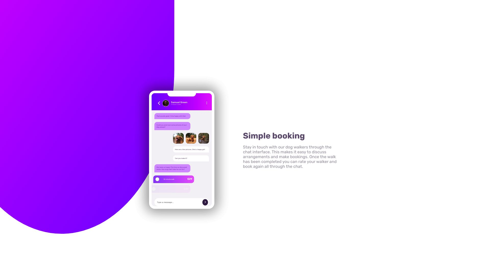

# Frontend Mentor - Chat app CSS illustration solution

This is a solution to the [Chat app CSS illustration challenge on Frontend Mentor](https://www.frontendmentor.io/challenges/chat-app-css-illustration-O5auMkFqY). Frontend Mentor challenges help you improve your coding skills by building realistic projects. _

## Table of contents

- [Overview](#overview)
  - [The challenge](#the-challenge)
  - [Screenshot](#screenshot)
  - [Links](#links)
- [My process](#my-process)
  - [Built with](#built-with)
  - [What I learned](#what-i-learned)
  - [Useful resources](#useful-resources)
- [Author](#author)

## Overview

### The challenge

Users should be able to:

- View the optimal layout for the component depending on their device's screen size
- **Bonus**: See the chat interface animate on the initial load

### Screenshots

.jpeg)
.jpeg)

### Links

- Solution URL: [URL](https://github.com/abrarishere/chatAppWeb)
- Live Site URL: [URL](https://abrarishere.github.io/chatAppWeb/)

## My process

### Built with

- Semantic HTML5 markup
- CSS custom properties
- Flexbox
- Mobile-first workflow
- Font Awesome
- Google Fonts
- GSAP

### What I learned

I learned how to use GSAP for animations.

### Useful resources

- [GSAP](https://greensock.com/gsap/) - This helped me to animate the chat bubbles. I really liked this pattern and will use it going forward.
- [Font Awesome](https://fontawesome.com/) - This helped me to add icons to the project. I really liked this pattern and will use it going forward.
- [Google Fonts](https://fonts.google.com/) - This helped me to add fonts to the project. I really liked this pattern and will use it going forward.

## Author

- Website - [Chat App Web](https://abrarishere.github.io/chatAppWeb/)
- Frontend Mentor - [@abrarishere](https://www.frontendmentor.io/profile/abrarishere)
- Twitter - [@abrarishere_](https://www.twitter.com/abrarishere_)

